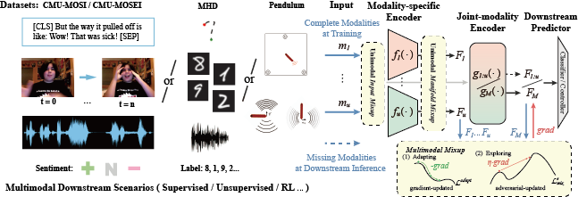

# Multimodal Mixup for Representation Learning

Official Implementation of "Adapt and Explore: Multimodal Mixup for Representation Learning"



## Table of Contents
- [Setup/Installation](#Setup/Installation)
- [Download Datasets](#Download-Datasets)
- [Download Pre-trained Models](#Download-Pre-trained-Models)
- [Evaluation](#Evaluation)
- [Train](#Train)
- [Acknowledgments](#Acknowledgments)

## Setup/Installation
```bash
conda env create -f m3ixup.yml
conda activate m3ixup
poetry install
```

## Download Datasets
```bash
cd download/
bash download_unsupervised_dataset.sh
bash download_supervised_dataset.sh
bash download_rl_dataset.sh
```

## Download Pre-trained Models
To replicate the results, download the pretrained models:
```bash
cd download/
bash download_unsupervised_pretrain_m3ixup_models.sh
bash download_supervised_pretrain_m3ixup_models.sh
bash download_rl_pretrain_m3ixup_models.sh
```

<!--

## Experiments
This repository contains the code to replicate the experiments presented in the [paper](https://arxiv.org/abs/2202.03390) within the `gmc_code` folder. In every experiment, please set up the corresponding local machine path in `ingredients/machine_ingredients.py` file by copying the output of `pwd` to the ingredient file (e.g. for the unsupervised experiment):
```bash
cd unsupervised/
pwd

# Edit unsupervised/ingredients/machine_ingredients.py
@machine_ingredient.config
def machine_config():
    m_path = "copy-output-of-pwd-here"
```


### 1) Unsupervised Learning (MHD)

#### - Train Model

```bash
echo "** Train GMC"
python main_unsupervised.py -f with experiment.stage="train_model" 

echo "** Train classifier"
python main_unsupervised.py -f with experiment.stage="train_downstream_classfier"
```

#### - Evaluate/Replicate Results

```bash
echo "** Evaluate GMC - Classification"
python main_unsupervised.py -f with experiment.evaluation_mods=[0,1,2,3] experiment.stage="evaluate_downstream_classifier"

echo "** Evaluate GMC - DCA"
python main_unsupervised.py -f with experiment.stage="evaluate_dca"
```

- To evaluate with partial observations, select between `[0], [1], [2], [3]` in `experiment.evaluation_mods`;
- The DCA results are saved in the `evaluation/gmc_mhd/log_0/results_dca_evaluation/` folder. For example, geometric alignement of complete and image representations are given in the `joint_m1/DCA_results_version0.log` file.


### 2) Supervised Learning (CMU-MOSI/CMU-MOSEI)

#### - Train Model

```bash
echo "** Train representation model"
python main_supervised.py -f with experiment.scenario="mosei" experiment.stage="train_model" 
```

#### - Evaluate/Replicate Results

```bash
echo "** Evaluate GMC - Classification"
python main_supervised.py -f with experiment.scenario="mosei" experiment.evaluation_mods=[0,1,2] experiment.stage="evaluate_downstream_classifier"

echo "** Evaluate GMC - DCA"
python main_supervised.py -f with experiment.scenario="mosei" experiment.stage="evaluate_dca"
```

- You can use CMU-MOSI dataset for both training and evaluation by setting `experiment.scenario="mosi"`;
- To evaluate with partial observations, select between `[0], [1], [2]` in `experiment.evaluation_mods`;
- The DCA results are saved in the `evaluation/gmc_mosei/log_0/results_dca_evaluation/` folder. For example, geometric alignement of complete and text representations are given in the `joint_m1/DCA_results_version0.log` file.


### 3) Reinforcement Learning (Multimodal Atari Games)

#### - Train Model

```bash
echo "** Train representation model"
python main_rl.py -f with experiment.stage="train_model" 

echo "** Train controller"
python main_rl.py -f with experiment.stage="train_downstream_controller" 
```

#### - Evaluate/Replicate Results

```bash
echo "** Evaluate GMC - RL Performance"
python main_rl.py -f with experiment.evaluation_mods=[0,1] experiment.stage="evaluate_downstream_controller"

echo "** Evaluate GMC - DCA"
python main_rl.py -f with experiment.stage="evaluate_dca"
```

- To evaluate with partial observations, select between `[0], [1]` in `experiment.evaluation_mods`;
- The DCA results are saved in the `evaluation/gmc_pendulum/log_0/results_dca_evaluation/` folder. For example, geometric alignement of complete and text representations are given in the `joint_m1/DCA_results_version0.log` file.

-->

## Acknowledgments
We would like to express our gratitude to [huggingface](https://huggingface.co/) and [gmc](https://github.com/miguelsvasco/gmc), which are of great help to our work.

